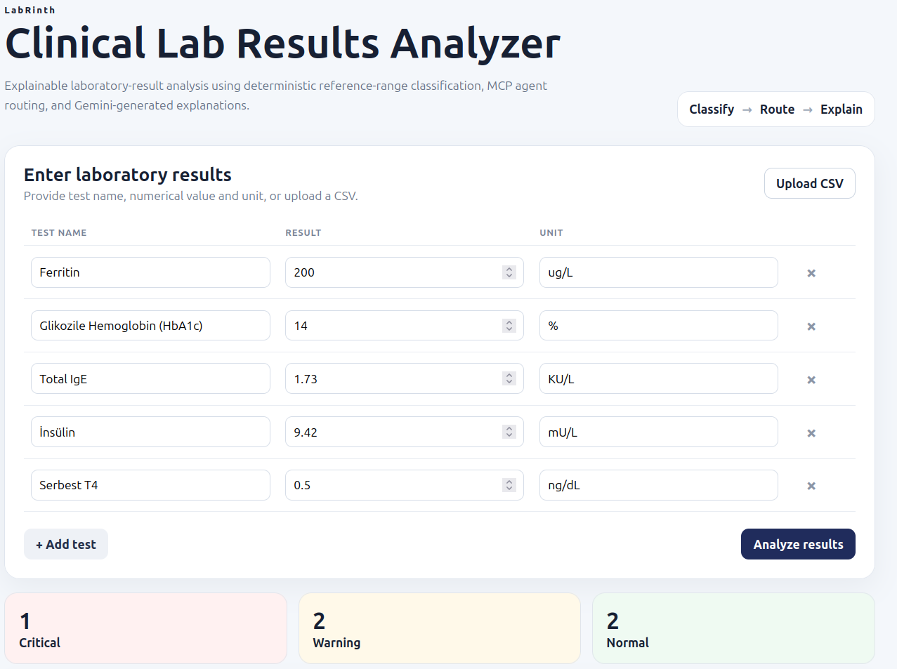
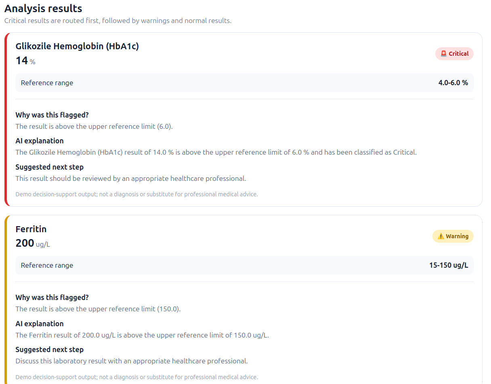
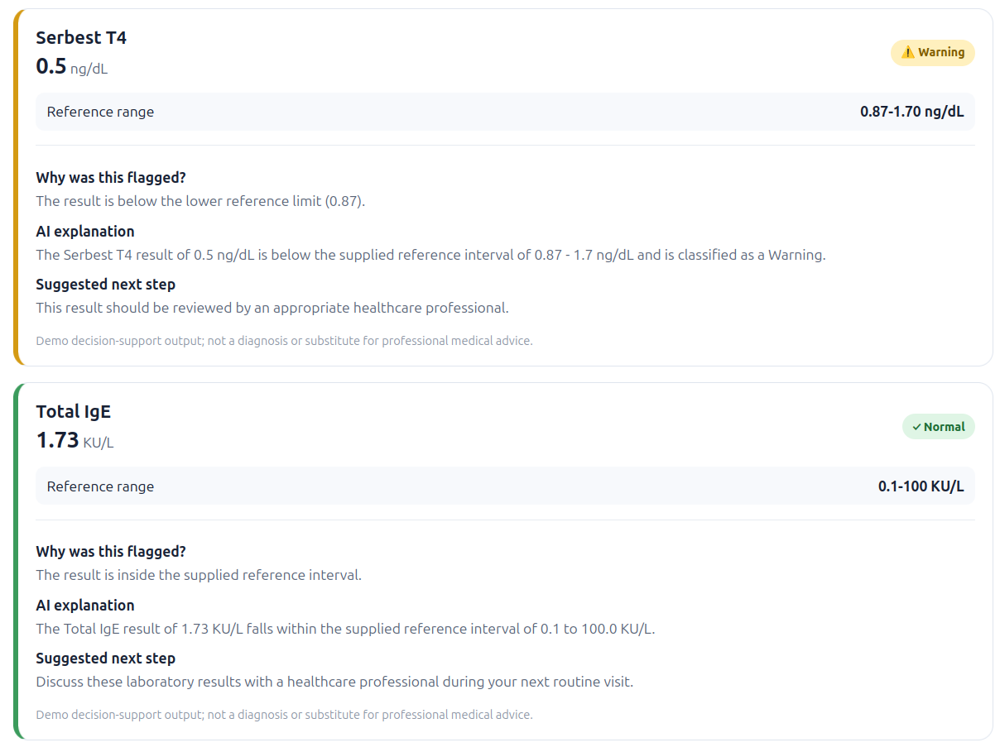

# Clinical Lab Results Analyzer

A full-stack implementation of the supplied **GenAI + Full-Stack Assignment: Clinical Lab Results Analyzer**.

## Live Demo

> **Important:** The application is hosted on Render's free tier. The backend services may go to sleep after a period of inactivity.
>
> Before opening the live application, **open the API and MCP links below once** to wake up the services. Wait a few seconds for each service to respond, then open the live frontend.

### 1. Wake up the FastAPI Backend

Open: https://clinical-lab-api.onrender.com


### 2. Wake up the MCP Server

Open: https://clinical-lab-mcp.onrender.com/mcp


### 3. Open the Live Application

After waking up both backend services, open:

**[Clinical Lab Results Analyzer – Live Demo](https://clinical-lab-analyzer-6m91.onrender.com/)**

The application allows you to:

- Enter laboratory test results manually
- Upload laboratory results using CSV
- Compare results against reference ranges
- Classify results as **Normal, Warning, or Critical**
- Route results according to severity
- Generate AI-powered explanations using Gemini
- View recommended follow-up actions
- Inspect the reference range and classification reasoning

### Deployment Links

| Component | URL |
|---|---|
| **Frontend / Live Demo** | https://clinical-lab-analyzer-6m91.onrender.com/ |
| **FastAPI Backend** | https://clinical-lab-api.onrender.com |
| **FastAPI Swagger** | https://clinical-lab-api.onrender.com/docs |
| **MCP Server** | https://clinical-lab-mcp.onrender.com/mcp |

## Assignment mapping

- `POST /analyze_labs` accepts lab name, value and unit.
- Agent workflow: **Classify -> Route -> Explain**.
- Deterministic reference-range lookup and severity classification happen through MCP tools.
- Gemini is called for an explanation for every result.
- React supports manual input and CSV upload.
- Results are routed in the order Critical -> Warning -> Normal.
- Three synthetic CSV files are included under `test_data/`.

The assignment requires an MCP server and says all communication should be handled by the Agent; this implementation therefore has FastAPI calling an Agent, and the Agent calls the MCP server tools rather than having FastAPI call the MCP tools directly.

## Application Screenshots

### Laboratory Results Input
Users can enter laboratory results manually or upload a CSV file for batch analysis.


### Severity Classification & Results
The analyzer displays results according to their calculated severity and reference ranges.




## Architecture

```text
React
  |
  | POST /analyze_labs
  v
FastAPI
  |
  v
ClinicalLabAgent
  |
  +---- MCP: reference_range_lookup
  |
  +---- MCP: classify_lab
  |
  +---- MCP: generate_clinical_explanation
                    |
                    v
                 Gemini API
                    |
                    v
             structured explanation
```

## Backend setup

Python 3.10+ is required by the current MCP Python SDK.

```bash
cd backend
python -m venv .venv

# Linux/macOS
source .venv/bin/activate

# Windows PowerShell
# .venv\\Scripts\\Activate.ps1

pip install -r requirements.txt
cp .env.example .env
```

Put your Gemini API key in `.env`:

```env
GEMINI_API_KEY=your_key_here
GEMINI_MODEL=gemini-2.5-flash-lite
MCP_SERVER_URL=http://127.0.0.1:8001/mcp
FRONTEND_ORIGIN=http://localhost:5173
```

### Start MCP server

Terminal 1:

```bash
cd backend
uvicorn mcp_server.server:app --host 127.0.0.1 --port 8001
```

### Start FastAPI

Terminal 2:

```bash
cd backend
uvicorn app.main:app --reload --host 127.0.0.1 --port 8000
```

### Start React

Terminal 3:

```bash
cd frontend
npm install
npm run dev
```

Open the Vite URL shown in the terminal, normally `http://localhost:5173`.

## API

### POST `/analyze_labs`

Request:

```json
{
  "labs": [
    {
      "test_name": "Ferritin",
      "value": 28.9,
      "unit": "ug/L"
    }
  ]
}
```

Response shape:

```json
{
  "results": [
    {
      "test_name": "Ferritin",
      "value": 28.9,
      "unit": "ug/L",
      "reference_range": "15.0 - 150.0",
      "min_reference": 15.0,
      "max_reference": 150.0,
      "severity": "Normal",
      "route_order": 3,
      "reason": "The result is inside the supplied reference interval.",
      "explanation": "...",
      "recommended_followup": "...",
      "disclaimer": "..."
    }
  ],
  "summary": {
    "critical": 0,
    "warning": 0,
    "normal": 1
  }
}
```

## Severity policy

The assignment requires three statuses but does not define a numeric threshold for Warning vs Critical. This demo therefore uses a transparent configurable heuristic:

- Normal: value is inside the supplied reference interval.
- Warning: value is outside the interval.
- Critical: below 50% of the lower reference limit or above 150% of the upper reference limit.

This is an implementation heuristic for the assignment, **not a validated clinical decision rule**. A production system should use laboratory- and analyte-specific validated thresholds.

## Test data

- `test_data/normal.csv` — all values inside the configured ranges.
- `test_data/warning.csv` — moderately out-of-range values.
- `test_data/critical.csv` — strongly out-of-range values.

## MCP tools

### `reference_range_lookup(test_name)`
Returns the configured reference interval, expected unit and follow-up text.

### `classify_lab(value, min_reference, max_reference)`
Performs deterministic classification and returns severity, reason and routing order.

### `generate_clinical_explanation(...)`
Calls Gemini and returns structured explanation and recommended follow-up. The prompt explicitly prohibits diagnosis and unsupported medical claims.

## Why classification is not delegated to the LLM

The reference-range comparison is deterministic and explainable. This makes the core classification reproducible and auditable. The LLM is used where natural-language generation is actually needed: explaining why a result was flagged and presenting a cautious next step.

## Error handling

The backend returns HTTP 400 for:

- unknown lab names
- missing/invalid lab values
- unit mismatches
- invalid reference ranges

It returns HTTP 502 when the MCP or Gemini layer fails.

## MCP Inspector

The current MCP Python SDK provides an Inspector workflow for testing MCP servers. You can use the SDK's development tooling to inspect and invoke the registered tools during development.
